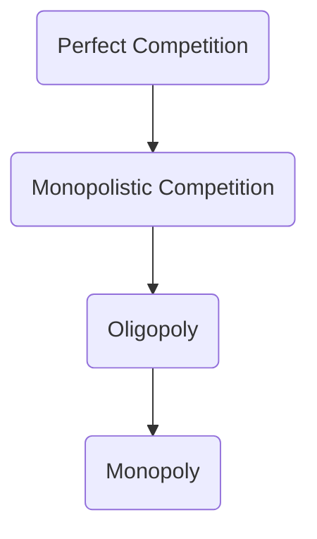

# Lecture 3

- Q = Quantity
- P = Price
- Marginal Cost MC = $\Delta \frac{TC(Q)}{Q}$
- Marginal Revenue MR = $\Delta \frac{TR(Q)}{Q}$
- Average Total Cost $ATC(Q) = \frac{TC(Q)}{Q}$
- Profit $\Pi (Q) = TR(Q) - TC(Q)$
- Profit Maximization Point Q*: MC = MR
  - Cost of producing an additional unit of output (MC) equals the revenue that
    would be received from that additional unit of output (MR)
  - 

### Example Questions

Given maximized profit at Q*, what are TFC(Q*), TVC(Q*)?

- $TC(Q) = \frac{125Q^3}{3} + 1000$, Price is \$2000 per Q
- So $TVC = 125Q^3/3$, $TFC = 1000$
- $\Pi (Q) = TR(Q) - TC(Q) = 2000 \cdot Q - 125Q^3 - 1000$
- Maximize profit: $\frac{\delta \Pi (Q)}{\delta (Q)} = 0 = 2000 - 125Q^2
  \implies Q^2 = 16 \implies Q = 4 = Q^*$

# Lecture 6

Marginal Revenue $MR(Q) = \frac{\partial TR(Q)}{\partial Q}$ where TR is Total
Revenue

## Profit Maximization under a Monopoly

Profit $\Pi(Q) = TR(Q) - TC(Q) = P(Q)\cdot Q - TC(Q)$

$0 = \frac{\partial PC(Q)}{\partial Q}\cdot Q + P(Q) - MC(Q)$

Thus $MR(Q) = MC(Q)$ at profit maximization point under a monopoly.

At profit maximization point, the price you are selling at is the value of the
demand line D at that point.

This is because the demand is linearly decreasing and we want to maximize the
area of the graph (max profit) which just means using a square at the halfway
point of the line, since the demand is decreasing linearly.

**NOTE:** This assumes NO ENTRY because monopolist will kick out competitors.

_**Bottom Line**_: Profit maximization point's cost is much higher in monopoly
than with perfect competition (Value of D (high) vs. intersection of MC and D
(lower))

## How to remain a monopoly

- Buy out competition
- Differentiate product line
  - Increase "switching cost": cost (for the consumer) of switching from your
    product to another (like vendor lock)

## Natural Monopoly

Think of why there is usually one sports team per city (if any). The team is not
trying to prevent competition, it's just that the newcomers will be naturally at
a disadvantage.

Natural monopolies usually happen if ATC is quite high in an industry.

Here there is much more margin for success: you do not need to keep out
competitors because you both can succeed.

## Monopolistic Competition

Demand shifts to the left and becomes flatter as more competitors enter: Change
in demand D starts negative, and more competitors means
$\frac{\mathrm{dD}}{\mathrm{dQ}} \to 0$ and initial demand (y intercept) is
smaller.

Eventually we reach zero economic profit (not zero profit! just as much profit
as you would earn anywhere else)

## Consumer Surplus

Difference between what consumers are willing to pay and what they actually end
up paying

### Price discrimination

Determine how much different consumers are willing to pay and charge them more
(e.g. pay more for better airline seat)
